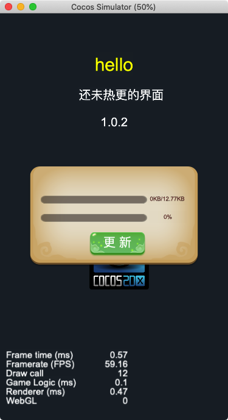
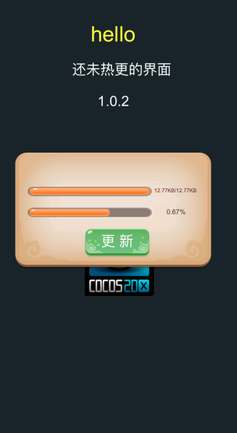
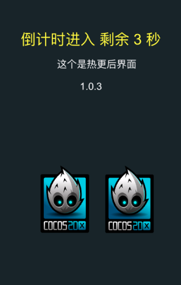
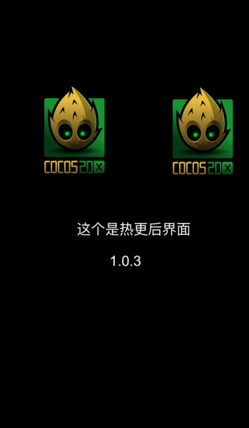

# Cocos Creator 热更新 Demo
## 项目说明

### master 分支

Cocos Creator 2.4.2 版本

### ccc_2.2.0

Cocos Creator 2.2.0 版本

### 2020年9月9日更新 2.4.2 热更新版本

更新前  场景内 一个图标  更新后 变成两个  游戏我写了俩场景测试 

更新前效果 1.0.2

点击更新后开始更新

更新后 两个场景

### 项目说明

- remote 下面 是远程版本 1.0.2
- build 下是 本地编译后的版本

### 效果展示

更新前

